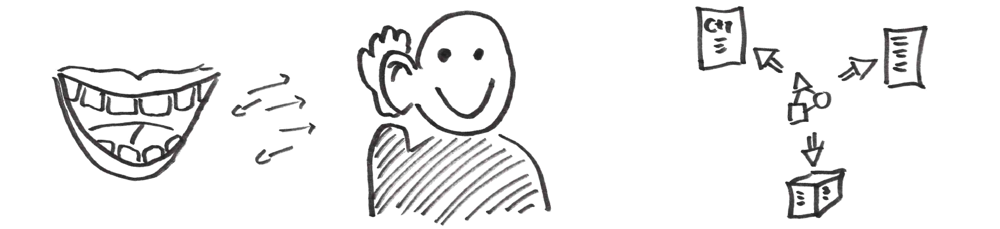

# Motivation

The problem to be solved is two-fold: avoid problems with
__communication__ and __consistency__.
A _common language_ will be defined to ease __communication__ within and
between teams. A _single source_ of information implies __consistency__,
and in turn, prevents misunderstandings.

A very good introduction to domain modeling is
::namedref::(references.md#tomassetti2017).

## MDSD and DSLs

__Model driven software development (MDSD)__ allows
introducing a supplementary layer of
abstraction above the code: This additional complexity can be employed to
replace traditional model traditional model based design approaches, and
thus represents a significant design element of a software architecture.
Such model driven approaches often also refer to
__domain specific languages (DSL)__.
These languages make the design easy to communicate (defined language at
design level) and at the same time the design itself constitutes of actual
software artefacts, since code is directly generated from it (single
source of information).

## Meta-model, model, and all that

The meta modeling toolsets utilized on this site typically allow to define
__(1) a meta model definition__, which defines what is modeled, e.g.,
the basic layout of a data structure in terms of structures which have
attributes. This meta model can be compared to a _data base layout_.
It also can be compared to _glossary_ for a given domain.
Using the meta model __(2) model data__ can be defined by a user.
This model data represents the concrete _data structures for a given domain_.
__(3) Validation__: importantly, the meta model definition allows to validate
and check concrete models. Finally, __(4) code generators and
model transformations__ represent primary end user tools to allow mass
production based on a _single source_ of information (the model).

## Real value for a project

Notably, if a model represents a real abstraction of a software
aspect - something people talk about and which hides important
details - we get a big impact in productivity. From the one and
single source of specification (the model data) we can extract
documentation, plan and archive changes (in the models) and at
the same time guarantee the consistency of model and multiple code artefacts.

The __real value__ in terms of working hours is not the meta model, the code
generator or the editor of a model, but the __model data__ itself. The
rest of the employed toolset and definitions (e.g. the meta model) further
increase this value, by allowing to validate, transform or
evaluate the model data.

Keeping this in mind, one should keep in  mind to be able to parse and
understand the model data in, say, 10 years. Also think about wht happens if
multiple users create conflicts in model files. One should be able to repair
such situations. This is easier if the model stored on disk resembles the
model entered by the user, than if an alternative representation is used
with, e.g., binary data representations or machine generated IDs which are
difficult to understand. Such a simple representation on disk also allows to
easily analyze a model with a traditional text search tool (grep) and to
make quick modifications to the model with a simple editor.

Moreover, the interoperability of employed toolsets is of crucial importancy:
the ability to define inter-model relations eases large scale model
driven approaches and the IDE integration increases end user acceptance.

