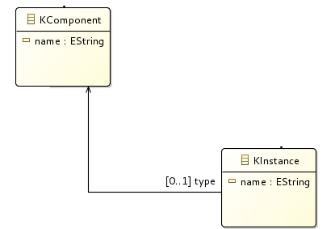
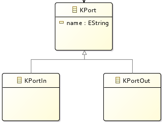

# A First Grammar

The goal of this exercise is to define a grammar for a structure as sketched in
the image below: A __Model__ shall contain __Packages__. Every __Package__
can contain __Component__ definitions and "Service" definitions.
A "Service" can __instantiate__ the Components.
Moreover shall a Component definition contain __input ports__
and __output ports__.

All __bold__ elements in the text above will be defined in our the grammar of
our meta model.

## First steps after project initialization

A grammar describes the syntax (more or less without semantic) of our
domain language describing domain models.
Internally, Xtext deduces an ecore model from the grammar, which can be used
to display the structure of the grammar (like the image in the first part of this
page).
The grammar remains the master (for maintenance) and the ecore model is recreated
after every change.

Note: Is is also possible to create a grammar based on an ecore model
(via Eclipse Wizard).

Additional information can be found in the [references list](references.md) or
in the offline help of Eclipse: "Help" - "Help Contents".

## Root node of a model

  * A grammar conists of __rules__, starting with the name of the rule,
    followed by a colon ":" and the rule itself,
    and is terminated by a semicolon ";".
  * The first rule in the grammar (e.g. "Model") is the root of the model.
  * Instead of adding elements to the model of type "Greeting", we will
    add elements of type "KPackage" (change the name "Greeting" to "KPackage").
  * See also [(Mooji et al., 2017a)](references.md#mooji2017a)

## Attributes, Composition

A "KPackage" element, in turn, shall be composed of "KComponent" and "KService"
elements:

The syntax for the composition is given as follows:

    KPackage: 'package' name=ID '{'
            (
                components += KComponent |
                services += KService
            )*
        '}'
    ;

  * 'package', '{', '}'
    * represent __keywords__ of our language.
  * name=ID
    * "name" is an __attribute__ in the meta mode (the attribute "name" has
       a special meaning: it is used to __indentify__ elements).
    * "=" means: this is a scalar value (no list of values).
    * __ID__ is a __terminal__ (see grammar, and click "F3" on
      "org.eclipse.xtext.common.Terminals" to see definition).
  * components += KComponent
    * "components" is an attribute in the meta model.
    * "+=" means, this is a __list of values__ (add one element to this list here)
    * "KComponent" and "KService" are __rule definitions__ like "KPackage"
      (need to be added)
  * ( ... | ... )*
    * Everything with the brackets can be repeated  0 to n times ("+" instead
      of "*" means 1 to n times).
    * "|" is a logical OR.

Modify the grammar to allow to enter the following model. Test the
grammar with this example (run the grammar as described
[in the previous section](xtext_project_setup.md)): "Run As" -
"Xtext Artifacts". The new Eclipse instance can easily be
started via the Debug icon).

    package test1 {
        Component PC {
        }
        Component DF {
        }
        service MyService {
        }
    }

## References

    KInstance: 'instance' name=ID ':' type=[KComponent];

  * type=[KComponent]
     * "type" is an attribute in the meta model.
     * "[KComponent]" is a __reference__ to a "KComponent" element.
     * for more inforamtion see the [references list](references.md).

## Specialization

    KPort:
        KPortIn|KPortOut
    ;
    KPortIn:
        'port_in' name=ID '{'
        '}'
    ;
    KPortOut:
        'port_out' name=ID '{'
        '}'
    ;

  * Base: SpecialA|SpecialB;
     * Defines a base class (base rule) for the specializations separated
       by "|".
     * Common attributes are availabe in the base class (here: "name")
     * for more inforamtion see the [references list](references.md).
