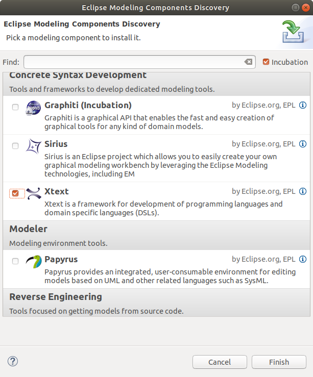

# Xtext and Eclipse

Xtext is integrated in Eclispe.
To run this tutorial (using Xtext) you need to install Eclipse with the appropriate
plugins (current version: Oxygen).

Note: The parser "Antlr" is not distributed with eclipse. You need to install
it manually [(itemis update site)](http://download.itemis.de/updates),
else it will be downloaded for every Xtext project you create.

## Download and install

Download the package
["Eclipse Modeling"](http://www.eclipse.org/downloads/packages/).
Unpack the archive to make eclipse available.

    ::shell
    root@xtext:~/Download# ls
    eclipse-modeling-oxygen-3a-linux-gtk-x86_64.tar.gz
    root@xtext:~/Download# tar xzf eclipse-modeling-oxygen-3a-linux-gtk-x86_64.tar.gz
    root@xtext:~/Download# mv eclipse /opt/
    root@xtext:~/Download# /opt/eclipse/eclipse &

To complete the installation you need "Install Modeling Components" from the
"Help" menu entry. Select the "Xtext" entry and "Finish" the installation by
restarting eclipse.

