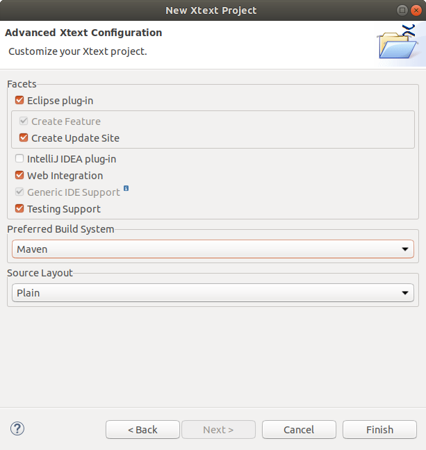
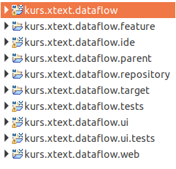

# Xtext Project Setup

## Create a new Xtext Project

In Eclipse

  * Select in the menu "File" - "New" - "Project".
  * Select "Xtext Project" and click "Next"
  * Specify the project name:
      * "__Project name__": "course.xtext.dataflow"
      * "__Name__": "course.xtext.dataflow.DataFlowDsl"
      * "__Extension__": "dataflow"
    then click "__Next__"

  

  * In the next step can configure your project.
    Select "Maven" as "Prefered Build System".

    

    Do not ignore warnings concerning "Maven integration for eclipse (m2e)".
    If neccessary install "m2e" via "Help" - "Install New Software"
    - "All Availabe Sites" and restart Eclipse.

Finally, some projects are created in your workspace, from which we will
only use a few of them at the moment (details: see ::namedref::(references.md#mooji2017a)).
An example grammar definition is created and opened in the editor.

## Compile and Run the Project

In Eclipse (e.g., after a new project is created)

  * In the grammar editor right click "Run As" / "Generate Xtext Artifacts"
  * In the menu: "__Run__" - "__Debug Configurations__"...
      * select "__Eclipse Application__"
      * click Icon "__New Launch Configuration__"
      * optional: specify configuration __name__ and __location__ of workspace.
        (the Xtext create language plugin will run in a new Eclipse instance)
      * click "__Debug__"

In the new Eclipse instance the new language can be used:

  * In the "__Package Explorer__" click "__New Project__".
  * Select "__Java Project__“ to create a new Java Project
    (You can also choose, e.g., a C++ or an Empty Project).
  * Create a folder "model" in this project.
  * In this folder create a model file: "__New__" - "__File__"
    with "__File Name__"="test1__.dataflow__" (+"__Finish__").
    _Note_: the file ending is important and must match the file ending
    specified for your language.
  * Click "__Yes__" when you are prompted
    "Do you want to convert ... to an Xtext Project".

Now you can play with your new language (type CTRL-Space to get auto
completion). Enter the following example:

    ::raw
    Hello Pierre!
    Hello Tim!
    Hello Markus!

The grammar for this example (automatically created after project
initialization) may look as follows. A "Model" contains "Greetings".
Every "Greeting" consists of the Text 'Hello' and a name followed by '!'
(details later).

    ::antlr
    grammar org.xtext.example.mydsl.MyDsl with org.eclipse.xtext.common.Terminals
    generate myDsl "http://www.xtext.org/example/mydsl/MyDsl"
    Model:
        greetings+=Greeting*;
    Greeting:
        'Hello' name=ID '!';
